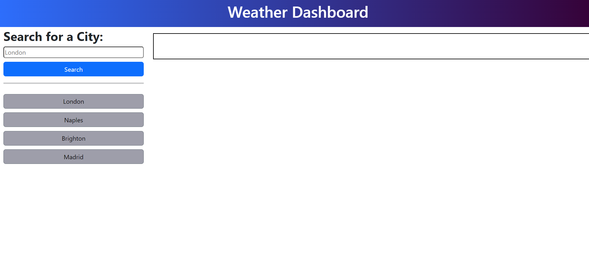
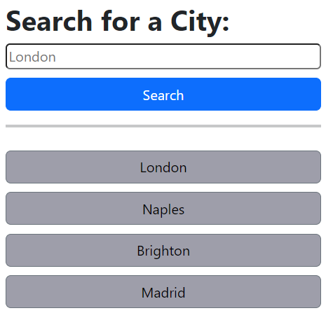
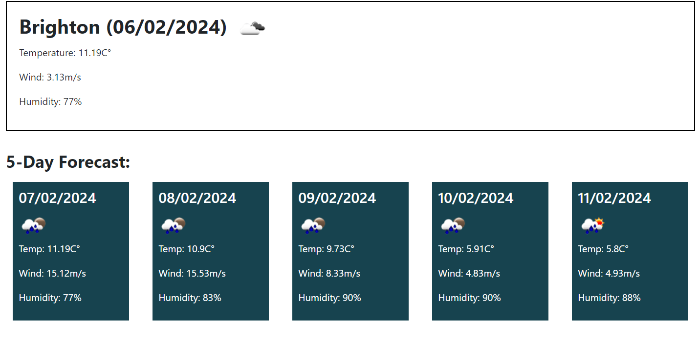

# Weather-Dashboard

## Description

Experience instant weather updates with this user-friendly website! Simply enter any city in the search bar to access current and 5-day forecasts. Conveniently revisit your past searches with a stored cities section for quick access to weather details. Stay informed effortlessly!

## Usage

* Here is a screenshot of the website landing page.

* This is the search bar, simply input the name of a city and click Search.
* Underneath, you can find buttons for each city you ever searched.
* Click on those buttons to check the city's weather.

* Once you selected the city, the main section of the page will display the current weather plus the next 5 days forecast.

## Deployment

* The site was deployed to GitHub Pages. The steps required are as follows:
    * From the GitHub main repository, navigate to Settings page.
    * Locate the Pages section.
    * Here, select Main Branch from the drop-down menu.
    * Once selected, GitHub will generate a link to the complete website.

## Technologies Used

### Languages Used

* [HTML5](https://en.wikipedia.org/wiki/HTML5)
* [CSS3](https://en.wikipedia.org/wiki/CSS)
* [JavaScript](https://en.wikipedia.org/wiki/JavaScript)
* [Markdown](https://en.wikipedia.org/wiki/Markdown)

## Credits

The HTML code was provided by the Bootcamp Spot instructor team.

## License

N/A
